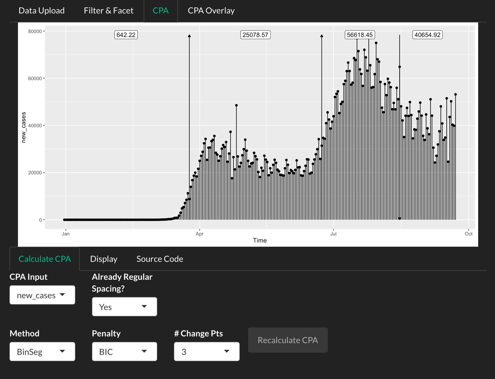
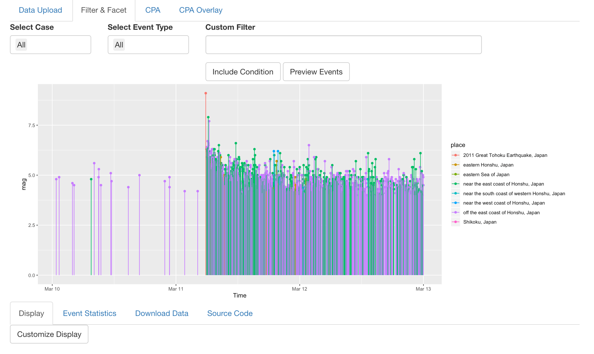
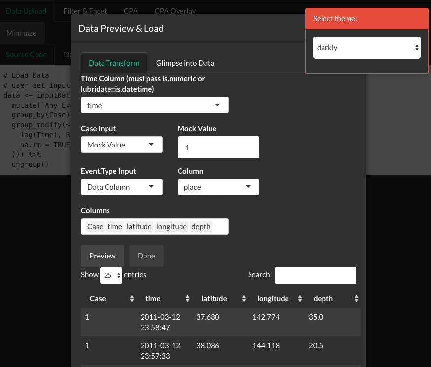
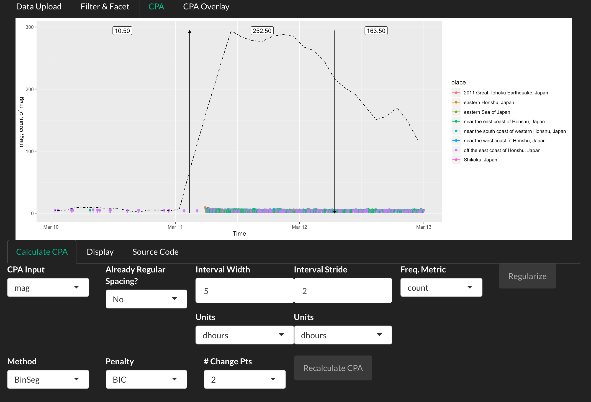
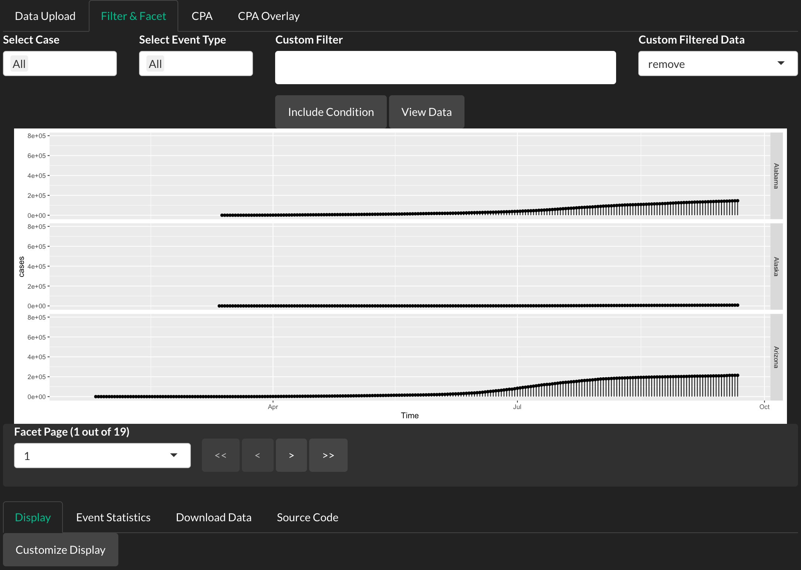
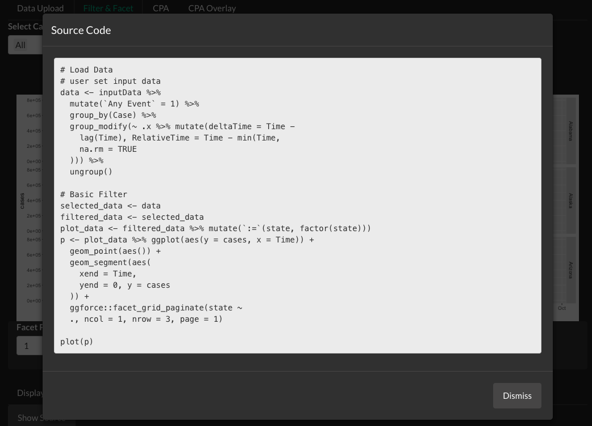

read-tv, Research & Exploratory Analysis Driven Time-data Visualization.
Version 0.1
================

  - [Description](#description)
  - [Installation](#installation)
      - [Through R/R Studio](#through-rr-studio)
      - [Docker](#docker)
  - [Usage](#usage)
      - [Data requirements](#data-requirements)
      - [Launch Application](#launch-application)
      - [CPA tab](#cpa-tab)
      - [Faceting](#faceting)

## Description

read-tv is a shiny application and associated console interface designed
for visualizing changepoints in **irregularly and regularly spaced**
longitudinal data. Technical users can rapidly view data through the R
console interface, and non-technical users can use it as a standard web
application. Intermediate users, as well as users who want to replicate
plots, will benefit from the source code generation associated with any
plot.

This application is built on top of a wide array of packages, and
especially wraps functionality from the
[changepoint](https://cran.r-project.org/web/packages/changepoint/index.html)
package and [tidyverse](https://github.com/tidyverse) set of packages.

Below is a plot of new COVID-19 cases in the United States with detected
changepoints. 

## Installation

### Through R/R Studio

This software has been tested with R Version 3.6.

This package is not on CRAN. Please install from GitHub with the
[install\_github function from the Devtools
package](https://www.rdocumentation.org/packages/devtools/versions/2.3.2).

``` r
# Install devtools if not yet installed
install.packages("devtools")
devtools::install_github("JDMusc/READ-TV")
```

### Docker

There is also a [Docker
option](https://github.com/JDMusc/read-tv-docker.git).

Please note that since the docker image is a light version of Ubuntu, it
will not run if the host machine (your local computer) is Windows.

## Usage

### Data requirements

A data frame or RDS/CSV file where each row is an observation. If the
data does not have columns for Case, Event.Type, or Time, then read-tv
will open a pop-up that enables the user to map Case and Event.Type to
another column (or mock value), and map Time to a column.

#### Sample Data Exports

read-tv exports 3 data sets:  
\* [Global COVID data, from Our World in
Data](https://ourworldindata.org/coronavirus-source-data)  
\* [US state-based COVID data, from NY
Times](https://raw.githubusercontent.com/nytimes/covid-19-data/master/us-states.csv)  
\* [USGS seismic records from Japan on
March 11, 2011](https://earthquake.usgs.gov/earthquakes/map).

#### Sample Data File

A sample CSV data file that works with read-tv can be found
[here](https://github.com/JDMusc/surgery-analysis/blob/master/data/events_phi_free.csv).
This was used for our research on workflow disruptions during surgery,
specifically an analysis of periods of time with high disruptions rates,
or cascades.

### Launch Application

The main function is **launchReadtv**.

``` r
launchReadtv()
```

Or it can be launched as

``` r
app = readtv::launchReadtv()
shiny::runApp(app)
```

Both files and in-memory objects can be passed to **launchReadtv**

``` r
library(dplyr)
library(magrittr)
library(readtv)

app = readtv::japan_eq_3_11 %>% 
  mutate(Time = time, Event.Type = place, Case = 1) %>% #bypass popup
  launchReadtv(plotOpts = tvOpts(y = mag, x = Time, color = place))

#shiny::runApp(app) #uncomment to run application
```

Executing the above `shiny::runApp(app)` code will generate the
following plot. The `plotOpts` argument and the `tvOpts` function tells
the plot to load with the specified axes, colors, etc.


If the code is run without the `mutate` call, then a pop-up first
requests the user to map the `Case`, `Time`, and `Event.Type` columns.

``` r
app = readtv::japan_eq_3_11 %>% 
  launchReadtv(plotOpts = tvOpts(y = mag, x = Time, color = place))

#shiny::runApp(app) #uncomment to run application
```



The `Filter & Facet` tab will show the same plot after the pop-up is
submitted.

read-tv exports 5 functions:

  - `launchReadtv`
      - launch the application  
  - `tvOpts`
      - tells the plot to load with the specified axes, colors, etc.  
      - used with `launchReadtv`’s `plotOpts` argument
  - `preprocessForCpa`
      - regularly spaces and smooths time series data
      - used in the `CPA` tabs
      - how to use visible from `Source Code` sub-tab.
  - `slidingWindow`
      - same sub-points as `preprocessForCpa`.  
  - `generatePlotDefaults`
      - user can run `generatePlotDefaults()` to view defaults for
        `tvOpts`  
  - `addCpaMarkersToPlot`
      - user can add cpa markers to a gg-plot.
      - used in the `CPA` tabs, after CPA is calculated
      - how to use visible from `Source Code` sub-tab.

Each of these functions has associated help documentation.

### CPA tab

The CPA tab has features to regularly space the data (preprocess), and
then execute methods from the changepoints package. It spaces the data
with the `preprocessForCpa` function and `slidingWindow` function.

To avoid the column mapping pop up, we can use dplyr to specify the
columns and mock values (Case) before it is passed into `launchReadtv`.

``` r
library(dplyr, warn.conflicts = FALSE)
library(magrittr)
library(readtv)

app = readtv::japan_eq_3_11 %>% 
  mutate(Time = time, Event.Type = place, Case = 1) %>% 
  launchReadtv(plotOpts = tvOpts(y = mag, x = Time, color = place))

#shiny::runApp(app) # and move to CPA tab after viewing in Basic display tab
```

Below is a screen shot from read-tv. Note that the time points are
regularized with values interpolated through a sliding window. The
timing intervals were not originally evenly spaced (irregular) since it
is earthquake event data. The CPA tab has functionality to create
regular spacing.



### Faceting

Sometimes it helps to facet and paginate the data.

``` r
app = readtv::covid_usa %>% 
  mutate(Time = date, Case = state, Event.Type = state) %>% 
  launchReadtv(plotOpts = 
                 tvOpts(y = cases, facetOn = state, isFacetPaginated = TRUE,
                        facetRowsPerPage = 3))

#shiny::runApp(app) #uncomment to run application
```



And the source code can also be viewed from the app. *Please note that
it assumes `tidyverse`, `changepoint`, `ggforce`, and `readtv` packages
are attached*.


