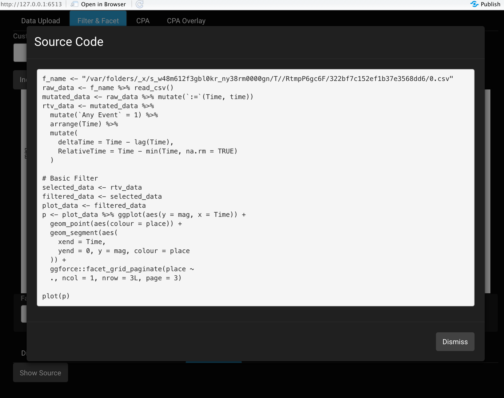
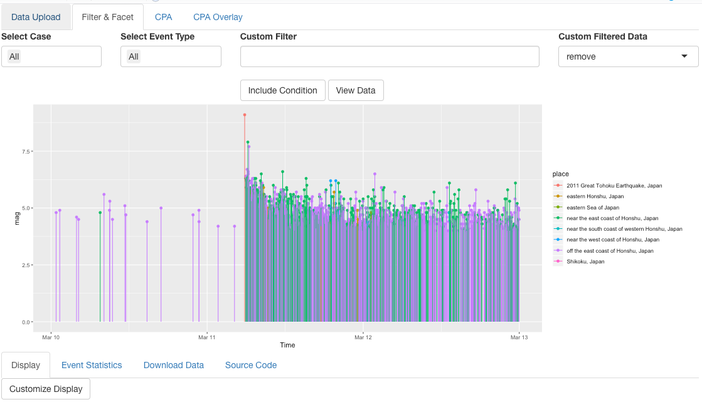

read-tv tutorial
================

  - [Installation](#installation)
  - [Sample Data](#sample-data)
  - [Launch Application](#launch-application)
  - [Data Upload](#data-upload)
      - [Source Code](#source-code)
  - [Filter & Facet](#filter-facet)
      - [Customize Display](#customize-display)
      - [Facet](#facet)
      - [Source Code](#source-code-1)
      - [Filter](#filter)
  - [Tab Layout](#tab-layout)
  - [CPA Tab](#cpa-tab)
  - [CPA Overlay Tab](#cpa-overlay-tab)
  - [Faster Prototyping](#faster-prototyping)
  - [Case and Event.Type](#case-and-event.type)
  - [Logging](#logging)

## Installation

Please follow the directions in the main
[README](https://github.com/JDMusc/READ-TV/blob/master/README.md).

## Sample Data

For this tutorial we will use the USGS data from the Great Tohoku
earthquake of 2011.

Though `read-tv` was originally designed for visualization of [surgical
workflow disruptions](https://github.com/JDMusc/surgery-analysis),
earthquakes are an informative use-case example of irregularly spaced
event data. In addition, this highlights how `read-tv` is generalizable
to different data sets.

The 2 main requirements for `read-tv` to work with a given data set:

1.  The data can be formatted as a table, with rows as data points and
    columns as features.
2.  There is at least one numeric, datetime, or time-string column that
    has no missing values.

The original file can be accessed from the R console if `read-tv` is
installed.

``` r
earthquake_f = system.file('extdata/earthquake_data', 
                           'query.csv', 
                           package='readtv')
```

It is also available to download.

1.  **The Great Japan Earthquake data publicly available from USGS.**
      - The earthquake data can be downloaded from
        [here](https://earthquake.usgs.gov/fdsnws/event/1/query.csv?starttime=2011-03-10%2000:00:00&endtime=2011-03-12%2023:59:59&maxlatitude=45.919&minlatitude=26.861&maxlongitude=149.414&minlongitude=129.023&minmagnitude=2.5&orderby=time).
      - If `read-tv` is installed
          - `earthquake_f = system.file('extdata/earthquake_data',
            'query.csv', package='readtv')`
      - The USGS map associated with this earthquake data is available
        [here](https://earthquake.usgs.gov/earthquakes/map/#%7B%22feed%22%3A%221576092040056%22%2C%22sort%22%3A%22newest%22%2C%22mapposition%22%3A%5B%5B26.861%2C129.023%5D%2C%5B45.919%2C149.414%5D%5D%2C%22viewModes%22%3A%5B%22list%22%2C%22map%22%5D%2C%22search%22%3A%7B%22id%22%3A%221576092040056%22%2C%22name%22%3A%22Search%20Results%22%2C%22isSearch%22%3Atrue%2C%22params%22%3A%7B%22starttime%22%3A%222011-03-10%2000%3A00%3A00%22%2C%22endtime%22%3A%222011-03-12%2023%3A59%3A59%22%2C%22maxlatitude%22%3A45.919%2C%22minlatitude%22%3A26.861%2C%22maxlongitude%22%3A149.414%2C%22minlongitude%22%3A129.023%2C%22minmagnitude%22%3A2.5%2C%22orderby%22%3A%22time%22%7D%7D%7D).


We can view the general layout of the data

``` r
library(knitr)
library(readtv)
library(tidyverse)

earthquake_data = read_csv(earthquake_f)
```

``` r
earthquake_data %>% glimpse
```

    ## Rows: 1,030
    ## Columns: 22
    ## $ time            <dttm> 2011-03-12 23:58:47, 2011-03-12 23:57:33, 2011-03-12…
    ## $ latitude        <dbl> 37.680, 38.086, 37.681, 37.075, 35.884, 36.995, 36.45…
    ## $ longitude       <dbl> 142.774, 144.118, 143.381, 143.387, 141.444, 144.158,…
    ## $ depth           <dbl> 35.0, 20.5, 8.7, 21.0, 38.8, 27.2, 25.6, 17.6, 35.0, …
    ## $ mag             <dbl> 4.5, 4.9, 5.0, 5.0, 4.5, 4.0, 4.4, 4.2, 4.1, 4.2, 4.1…
    ## $ magType         <chr> "mb", "mb", "mb", "mb", "mb", "mb", "mb", "mb", "mb",…
    ## $ nst             <dbl> 33, 137, 164, 206, 51, 26, 40, 20, 16, 15, 13, 241, 2…
    ## $ gap             <dbl> 122.5, 63.8, 67.6, 65.0, 114.5, 136.2, 127.5, 120.1, …
    ## $ dmin            <lgl> NA, NA, NA, NA, NA, NA, NA, NA, NA, NA, NA, NA, NA, N…
    ## $ rms             <dbl> 1.17, 0.84, 0.86, 0.72, 0.90, 0.89, 0.70, 0.82, 0.38,…
    ## $ net             <chr> "us", "us", "us", "us", "us", "us", "us", "us", "us",…
    ## $ id              <chr> "usp000hwp7", "usp000hwp6", "usp000hwp5", "usp000hwp4…
    ## $ updated         <dttm> 2014-11-07 01:44:03, 2014-11-07 01:44:03, 2014-11-07…
    ## $ place           <chr> "off the east coast of Honshu, Japan", "off the east …
    ## $ type            <chr> "earthquake", "earthquake", "earthquake", "earthquake…
    ## $ horizontalError <lgl> NA, NA, NA, NA, NA, NA, NA, NA, NA, NA, NA, NA, NA, N…
    ## $ depthError      <dbl> NA, 3.6, 13.4, 8.2, 8.5, 21.0, 17.0, 27.7, NA, 20.4, …
    ## $ magError        <lgl> NA, NA, NA, NA, NA, NA, NA, NA, NA, NA, NA, NA, NA, N…
    ## $ magNst          <dbl> 3, 76, 92, 129, 12, 4, 8, 3, 5, 7, 3, 164, 154, 1, 2,…
    ## $ status          <chr> "reviewed", "reviewed", "reviewed", "reviewed", "revi…
    ## $ locationSource  <chr> "us", "us", "us", "us", "us", "us", "us", "us", "us",…
    ## $ magSource       <chr> "us", "us", "us", "us", "us", "us", "us", "us", "us",…

## Launch Application

The main function is **launchReadtv**.

``` r
readtv::launchReadtv()
```

Or it can be launched as

``` r
app = readtv::launchReadtv()
shiny::runApp(app)
```

## Data Upload

First, we will upload the earthquake data file through the UI.

After the earthquake data file is browsed and uploaded, `read-tv` will
display a pop-up asking which columns are for Time, Case, and Event
Type. The only mandatory column is Time, for now we’ll select the “time”
column and ignore Case and Event Type. Once “time” is set to Time, press
submit.

``` r
readtv::launchReadtv()
```


I changed the theme to cyborg so that the screen shots are visible in
this tutorial. The themes drop-down is from the [shinythemes
package](https://www.rdocumentation.org/packages/shinythemes/versions/1.1.2).


*What to do if you uploaded the wrong file?*  
For `read-tv` version 0.1, the solution is to close the application and
run it again. Or if it is running remotely, open `read-tv` in a new
browser window.

### Source Code

Every `read-tv` tab has a `Source Code` sub-tab. `read-tv` uses
meta-programming to generate code in response to user input. The code is
evaluated to create visualizations. Therefore, any visualization can be
*reproduced* by executing this code within an R environment.


Notice that `f_name` is equal to the file’s path on the server. This is
because the `Source Code` sub-tab shows the exact code that is executed
by `read-tv`. To replicate any the code blocks: make sure `tidyverse`
and `readtv` packages are loaded, and update the file name to your local
path.

`read-tv` calculates 2 new columns from the data:  
1\. `RelativeTime`: time from the given event to the first event in data
(or `Case`, if a `Case` column is present).  
1\. `deltaTime`: inter-event times.

## Filter & Facet

Now we can look at the basic plot by clicking on the Filter & Facet tab.


#### Customize Display

This plot can be made more informative by changing the y-axis and
colors. Click on the `Customize Display` button in the `Display`
sub-tab. Set `Y` to “mag”, and `Color` to “place.”


After customizing the display, we now have a more informative plot.The
after shocks are readily visible.


### Facet

We can provide more information by faceting by place.


Pagination limits the number of plots per page, which can be scrolled.
Though for the this data the number of faceted plots (6) is relatively
small, so pagination seems to have no benefit.


### Source Code

We can view the source code to recreate the plot by clicking on the
`Show Source` button on the `Source Code` sub-tab.



The source code assumes `tidyverse` and `read-tv` set of libraries are
already loaded. It does not assume this about `ggforce`, which provides
facet grid.

### Filter

Though filtering can be done on both faceted and non-faceted plots, I
will remove the facet to facilitate visualization by putting all the
data in one plot. This can be done by clicking the `Customize Display`
button in the `Display` sub-tab, then clicking on the `Facet` drop-down,
and deleting the value with the backspace or delete button. When this is
done press `Submit`.


An R expression can be written in the `Custom Filter` text input section
to filter the data. In this case, we only keep the earthquakes with a
magnitude greater than 6.


This will *remove* the data from the downstream `CPA` analysis (the next
tab). However, sometimes we want to highlight certain data points, while
still retaining the data that does not pass the filter. We can set the
`Custom Filter Data` drop-down to “transparent”.


#### *What filters are permissible?*

In general, R language conditions that can be used to filter data in the
`tidyverse` packages. This is most apparent by viewing the plot\`s
source code.  


This allows for `tidyverse`’s powerful filtering capabilities.


There is also an `Include Condition` button underneath the `Custom
Filter`. This will pop up a graphical assistant to create filters.
However, it will likely never have the power of creating the filters
directly in R through the text input.

## Tab Layout

So far we have used 2 tabs, `Data Upload`, and `Filter & Facet`.  
There are 4 tabs in `read-tv 0.1`: `Data Upload`, `Filter & Facet`,
`CPA`, and `CPA Overlay`. Future versions will include a tab for
forecasts.

The data flows from left to right. This means that each tab only knows
about the tabs to the left. The data uploaded in `Data Upload` is passed
to `Filter & Facet`, but not the other way.

As stated earlier, if you need to upload new data. The best option is to
restart `read-tv`, if it is running locally. Or open a new browser
window, if it is running on a remote server.

## CPA Tab

The `CPA` tab will use the data from `Filter & Facet` to perform
changepoint analysis and any necessary pre-processing.

The `Calculate CPA` sub-tab will ask if the data is regularly spaced,
“Already Regular Spacing?”, which means fixed time interval between
data points.

CPA algorithms expect regularly spaced data, but most event data is
*irregularly* spaced. This is because events do not tend to occur at
fixed intervals.

So we will set the “Already Regular Spacing?” drop-down to “No”. We will
then regularize the data through a sliding window method. The window
duration will be 5 hours, and the window will slide across the data at a
fixed rate of every 2 hours. Within the window, the number of events
will be counted. In other words, this will create regularly spaced data
with intervals of 2 hours, and each data point is the number of events
that occurred within a 5 hour window (2.5 hours on each side of the time
point).


After pressing the `Regularize` button, the following plot comes up. It
shows both the event stem plot, and the number of events within a 5-hour
window at 2-hour intervals.  


The source code shows that the data is sent to the `read-tv`
`preprocessForCpa` function. The window width is set to 5 hours (18,000
seconds), the window stride is set to 2 hours (7,200 seconds), and the
aggregating function `agg_fn_expr` is set to the length, or count, of
the values within the window. `.values` is the vector of magnitude
points within the 5-hour window. But the element values themselves are
not used in this example. More advanced techniques to regularize the
time-intervals through interpolation may incorporate the magnitudes.


Finally, we can perform changepoint analysis. The `Method` was set to
Binary Segmentation, the `Penalty` was Bayesian Information Criterion,
and 3 change points were calculated.  


We did not develop novel CPA techniques. `read-tv` provides GUI access
to the R
[`changepoint`](http://www.lancs.ac.uk/~killick/Pub/KillickEckley2011.pdf)
package.

Killick et al provide informative descriptions of the `changepoint`
package algorithms.  
\- [An R Package for Changepoint
Analysis](http://www.lancs.ac.uk/~killick/Pub/KillickEckley2011.pdf)  
\- [Optimal Detection of Changepoints With a Linear Computational
Cost.](https://arxiv.org/pdf/1101.1438.pdf)  
\- [Analysis of changepoint models. Bayesian time series
models.](https://www.cambridge.org/core/books/bayesian-time-series-models/analysis-of-changepoint-models/CBED86FD9B97C2EE8D33C156A0AB8B0E)

## CPA Overlay Tab

The `CPA Overlay` tab overlays the `CPA` tab output changepoints on top
of the raw data from `Data Upload`.  


`CPA Overlay` also provides support for filtering and faceting data.
However, the data filtered in `CPA Overlay` will not alter `CPA` tab’s
changepoints (which are calculated from `Filter & Facet`’s output). This
can be beneficial for seeing if certain event types are near
changepoints, because event types not in question can be removed from
the `CPA Overlay` tab’s visualization.  


Of course, the source code to recreate this plot is available from the
`Source Code` sub-tab.

## Faster Prototyping

Both files and in-memory objects can be passed to **launchReadtv**

``` r
app = launchReadtv(eventsPath = earthquake_f)

#shiny::runApp(app) #uncomment to run application
```

``` r
app = earthquake_f %>% 
  read_csv %>% 
  mutate(Time = time, Event.Type = place, Case = 1) %>% #bypass popup
  launchReadtv(plotOpts = tvOpts(y = mag, x = Time, color = place))

#shiny::runApp(app) #uncomment to run application
```

Executing the above `shiny::runApp(app)` code will generate the
following plot. The `plotOpts` argument and the `tvOpts` function tells
the plot to load with the specified axes, colors, etc.


Notice that we did not have to work with the data transform pop-up in
the beginning which asks us to map `Time`, `Case`, or `Event.Type`. This
is because we created the columns through the `tidyverse` `mutate`
command before sending the data to `read-tv`.

## Case and Event.Type

While only the `Time` column is required, there are advantages to
setting `Case` and `Event.Type`, namely:

  - `Case`
      - A `Case` multi-select becomes available in the `Filter & Facet`
        and `CPA Overlay` tabs.  
      - `RelativeTime` is calculated for each case as time since first
        event for the given case. Rather than time since first event in
        the entire dataset.  
  - `Event.Type`
      - An `Event.Type` multi-select becomes available in the `Filter &
        Facet` and `CPA Overlay` tabs.

<!-- end list -->

``` r
categorizeMagnitude = function(mag)
  case_when(
    mag < 4 ~ '4_minor', #numbers preserve order for plots
    mag < 5 ~ '5_light',
    mag < 6 ~ '6_moderate',
    mag < 7 ~ '7_strong',
    mag < 8 ~ '8_major',
    TRUE ~ 'great'
  )


app = earthquake_f %>% 
  read_csv %>% 
  mutate(Time = time, Event.Type = categorizeMagnitude(mag), Case = place) %>%
  launchReadtv(plotOpts = tvOpts(y = mag, x = Time, color = Event.Type,
                                 facetOn = Case))

#shiny::runApp(app) #uncomment to run application
```


It is worth pointing out that the multi-select *only removes the data*,
it never sets the data to transparent. A new version of `read-tv` may
support transparency as well as removal for the multi-selects.

In the mean-time to obtain this functionality: we can still select with
the multi-select, view the generated code, copy that code to `Custom
Filter` while removing the multi-select, and set `Custom Filtered Data`
to “transparent”.

Select with the multi-select.


View the generated code.


Copy code to `Custom Filter` while setting the multi-select to “All”,
and set `Custom Filtered Data` to “transparent”.  


The source code for the above visualization has the multi-select filter
code moved to the `read-tv Filtered` column that encodes transparency.  


## Logging

It can be challenging to debug React-based applications. Therefore
`read-tv` logs most function calls logs with the [`R logger
package`](https://cran.r-project.org/package=logger).  
To turn off the log messages, pass a higher log level to the
`log_threshold` parameter of the `launchReadtv` function. Since all the
messages are logged at logger::INFO level, passing logger::ERROR to
`launchReadtv` will turn off logging.

``` r
app = launchReadtv(log_threshold = logger::ERROR)
```
